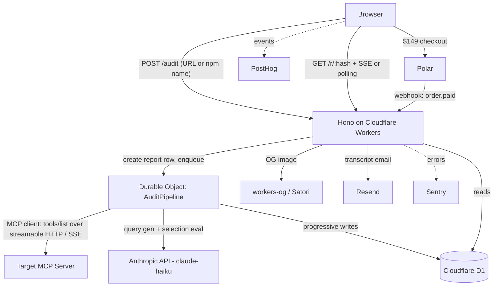

# PRD — MCP Audit

## 1. Overview

### Product Summary

**MCP Audit** — Paste an MCP server URL, get a permalink report showing which of your tools Claude actually selects — and how many tokens of context tax you're charging every conversation.

A no-login web microtool: a maintainer submits an MCP server URL or npm package name, watches checks stream in live (connect → tools/list → static pass → selection eval), and receives a permanent report at `/r/{hash}`. The behavioral wedge is a Haiku-powered tool-selection eval that never executes tools — it measures which tool the model reaches for per realistic query, producing one honest headline: `{effectiveTools}/{totalTools} tools effective · {defTokens} tokens of context tax`.

### Objective

This PRD covers the MVP as defined in `product-vision.md` § Product Strategy: ingest + static pass, selection eval harness, streaming permalink report with OG image, email capture unlocking transcripts, $149 Polar tune-up checkout, 3/day/IP rate limiting, and 20 pre-published famous-server reports. Build window: 7 days.

### Market Differentiation

The implementation must deliver what static checkers cannot: a behavioral claim ("4 of your 14 tools were never selected across 25 realistic tasks") backed by inspectable evidence (every eval call logged and retrievable). Three technical properties carry the differentiation: (1) the eval's anti-leakage query generation, which is the difference between a real measurement and theater; (2) the streaming report page, which turns the pipeline into visible receipts; (3) the tools/list hash cache, which makes free SEO-scale traffic economically survivable.

### Magic Moment

The maintainer sees which of their tools are invisible to Claude. What must be fast: static results stream within 2 seconds of submission. What must be seamless: paste → redirect to `/r/{hash}` → results appear with no reload, no login, no interstitial. What must work perfectly: ingestion against real-world servers (streamable HTTP and SSE), and the scoring math — a wrong number published under a company's name is the product's one unrecoverable failure mode.

### Success Criteria

- Time from submit to first streamed static result: < 2s.
- Time from submit to headline score on a 14-tool server: < 2 minutes.
- Fresh-report LLM cost: ≤ $0.10 per server at 14 tools; cost logged per report.
- Cache hit (same tools/list hash) serves the report with zero LLM calls.
- Hand-verification pass on 3 famous servers: < 10% questionable selections.
- OG image renders the headline score when a report link unfurls on X/Slack/Discord.
- A stranger can complete Polar checkout for the $149 tune-up.
- All P0 functional requirements pass their acceptance criteria.

## 2. Technical Architecture

### Architecture Overview



### Chosen Stack

| Layer | Choice | Rationale |
|---|---|---|
| Frontend | Server-rendered JSX via Hono (`hono/jsx`) | The report page is the UI; no framework keeps the whole app one Worker |
| Backend | Hono on Cloudflare Workers + Durable Object pipeline | Plain Worker times out mid-eval; the DO runs the pipeline and writes progressive results — the architecture *is* the streaming UX |
| Database | Cloudflare D1 | Three tables; tools/list hash as cache key protects unit economics from SEO traffic |
| Auth | None | No-login by design; optional bearer-token field for private servers |
| Payments | Polar | $149 tune-up checkout day 1, concierge fulfillment; the buy button is the willingness-to-pay test |
| Analytics | PostHog | The run → capture → checkout funnel is the entire kill-gate instrumentation |
| Email | Resend | Email capture unlocks eval transcripts |
| Error tracking | Sentry | Arbitrary user-supplied servers fail in creative ways |

### Stack Integration Guide

**Setup order:**

1. `npm create hono@latest` → cloudflare-workers template, TypeScript.
2. `wrangler d1 create mcp-audit` → add binding `DB` to `wrangler.toml`; write `schema.sql`; `wrangler d1 execute mcp-audit --file schema.sql`.
3. Add Durable Object class `AuditPipeline` to `wrangler.toml` (`[[durable_objects.bindings]]` + `[[migrations]]` with `new_sqlite_classes`).
4. `npm i @modelcontextprotocol/sdk @anthropic-ai/sdk` — MCP client + Haiku eval.
5. `npm i workers-og` for OG image generation (Satori-based, Workers-compatible).
6. Polar: create org, create the "$149 MCP Tune-up" product, configure webhook → `/webhooks/polar`; `npm i @polar-sh/sdk`.
7. Resend: domain + DKIM, `npm i resend`.
8. Sentry: `npm i @sentry/cloudflare`; PostHog via `posthog-js` snippet in the page shell (client-side only).

**Known integration patterns & gotchas:**

- **DO invocation:** the Worker route creates the `reports` row with `status='queued'`, then calls `env.AUDIT_PIPELINE.get(idFromName(hash)).fetch()` to start the pipeline, and returns the redirect immediately. Use `state.waitUntil`/`blockConcurrencyWhile` carefully — the pipeline should run in the DO's own execution, not the request's.
- **DO alarms for resilience:** set a DO alarm as a watchdog; if the pipeline stalls > 5 minutes, mark the report `status='failed'` with a user-visible error rather than leaving it spinning forever.
- **MCP client transports:** try Streamable HTTP first, fall back to SSE transport. Both are in `@modelcontextprotocol/sdk/client`. npm-package inputs resolve via the MCP registry/Smithery convention where possible; v1 may restrict npm inputs to packages that document a hosted URL — see Open Questions.
- **Live updates:** simplest robust option on Workers is polling — the report page fetches `/api/report/:hash` every 1.5s until `status='complete'`. SSE from the Worker reading D1 is possible but adds failure modes; polling is the ponytail choice and visually indistinguishable with streaming-style rendering.
- **Token counting:** count tokens of the serialized tool definitions with Anthropic's `countTokens` API (`client.messages.countTokens` with the tools array). Cache the result in the report row.
- **Haiku eval calls:** `tool_choice: {type: "auto"}`, `temperature: 0`, `max_tokens: 64`, `tools:` full toolset. Read the first `tool_use` block (or none) from the response. Cap concurrency at 5 with a simple semaphore around `Promise.all`.
- **Anti-leakage filter:** after query generation, tokenize the tool name (split on `_`, camelCase, strip stopwords like get/list/search/create); reject any query containing a non-stopword name token; regenerate once, then flag the query as `leaked=true` and exclude it from scoring rather than looping forever.
- **Polar webhooks:** verify signatures with the SDK helper; handle `order.paid` → mark `tune_up_orders` row, notify founder (email via Resend to self).
- **D1 gotcha:** no long transactions; use `batch()` for multi-statement writes from the DO.

**Environment variables / secrets (via `wrangler secret put`):**

```
ANTHROPIC_API_KEY      # Haiku eval + query generation + token counting
POLAR_ACCESS_TOKEN     # checkout session creation
POLAR_WEBHOOK_SECRET   # webhook signature verification
RESEND_API_KEY         # transcript + notification email
SENTRY_DSN             # error tracking
PUBLIC_POSTHOG_KEY     # client-side analytics (non-secret, in wrangler.toml [vars])
FOUNDER_EMAIL          # tune-up order notifications
```

### Repository Structure

```
mcp-audit/
├── src/
│   ├── index.tsx              # Hono app: routes, middleware, page shells
│   ├── pipeline/
│   │   ├── audit-pipeline.ts  # Durable Object class: orchestrates stages
│   │   ├── ingest.ts          # MCP client connect, tools/list, hashing
│   │   ├── static-checks.ts   # token count, schema, descriptions, name similarity
│   │   ├── query-gen.ts       # batched Haiku query generation + anti-leakage filter
│   │   ├── selection-eval.ts  # per-query Haiku selection calls, concurrency cap
│   │   └── scoring.ts         # ToolResult, effectiveTools, collisions, headline
│   ├── pages/
│   │   ├── Home.tsx           # landing: input field, published reports list
│   │   ├── Report.tsx         # /r/:hash — streaming report page
│   │   └── components.tsx     # shared JSX components
│   ├── routes/
│   │   ├── audit.ts           # POST /audit — create + kick off
│   │   ├── report-api.ts      # GET /api/report/:hash — polling endpoint
│   │   ├── capture.ts         # POST /api/capture — email capture
│   │   ├── checkout.ts        # POST /api/checkout — Polar session
│   │   ├── webhooks.ts        # POST /webhooks/polar
│   │   └── og.ts              # GET /og/:hash.png — OG image
│   ├── lib/
│   │   ├── db.ts              # D1 query helpers
│   │   ├── rate-limit.ts      # 3/day/IP check
│   │   ├── tokens.ts          # Anthropic countTokens wrapper
│   │   └── similarity.ts      # name near-duplicate check (Dice coefficient)
│   └── types.ts               # ToolResult, ReportStatus, shared types
├── schema.sql                 # D1 schema
├── scripts/
│   └── publish-famous.ts      # run + verify the 20 launch reports
├── wrangler.toml
├── package.json
└── docs/                      # VISION.md, product-vision.md, prd.md, product-roadmap.md
```

### Infrastructure & Deployment

- **Deploy:** `wrangler deploy`. One Worker, one DO namespace, one D1 database. Custom domain via Cloudflare (e.g. `mcpaudit.dev`) with the Worker on the apex route.
- **Environments:** `wrangler.toml` env blocks for `dev` (local `wrangler dev` + `--local` D1) and `production`. Polar sandbox mode in dev.
- **CI/CD:** GitHub Actions running `tsc --noEmit`, tests, then `wrangler deploy` on main. Optional for the 7-day window — `wrangler deploy` from the laptop is acceptable v1.
- **Backups:** D1 Time Travel covers point-in-time restore (30 days) — sufficient for v1.

### Security Considerations

- **SSRF is the top risk:** the product's core function is fetching user-supplied URLs from server-side. Validate: scheme must be `https` (allow `http` only for explicitly non-routable rejection testing — otherwise reject), resolve and reject private/reserved IP ranges (127.0.0.0/8, 10/8, 172.16/12, 192.168/16, 169.254/16, ::1, fc00::/7), reject cloud metadata hostnames (`metadata.google.internal`, `169.254.169.254`). Cap response sizes (1 MB tools/list) and total connect time (15s).
- **Never execute tools.** The MCP client calls `initialize` and `tools/list` only. No `tools/call`, ever — enforce by not importing/exposing that method in `ingest.ts`.
- **Bearer tokens for private servers:** used in-flight for the connection only; never written to D1, never logged, scrubbed from Sentry via `beforeSend`. State this in the UI next to the field.
- **Input validation:** URL/npm-name format validation at the route; email format validation on capture; all D1 access through parameterized queries (D1 prepared statements — never string interpolation).
- **Rate limiting:** 3 fresh (cache-missing) audits/day/IP keyed on `CF-Connecting-IP`, stored in D1 with a daily window. Cached-report views are unlimited. Also rate-limit `/api/capture` (10/day/IP).
- **Webhook security:** Polar signature verification; reject unsigned/invalid payloads with 401.
- **Sentry scrubbing:** configure `beforeSend` to drop `Authorization` headers, bearer tokens, and email addresses from events and breadcrumbs.
- **Content on named reports:** factual measured claims only; the report renders data from D1, no user-generated free text is displayed (no stored-XSS surface beyond tool names/descriptions — escape them, since they're attacker-controlled strings from arbitrary servers; `hono/jsx` escapes by default, don't use `dangerouslySetInnerHTML`).

### Cost Estimate

Monthly, first 6 months, < 1000 users:

| Service | Usage | Cost |
|---|---|---|
| Cloudflare Workers Paid (Workers + DO + D1) | required for Durable Objects | $5/mo base |
| D1 | well within free allowance at this scale | ~$0 |
| Anthropic API (Haiku) | ~$0.03–0.08/fresh report × ~300 fresh/mo (capped by 3/day/IP) | $10–25/mo |
| Polar | no monthly fee; ~4% + 40¢ per transaction | $0 fixed |
| Resend | free tier 3,000 emails/mo | $0 |
| PostHog | free tier 1M events/mo | $0 |
| Sentry | free tier 5k errors/mo | $0 |
| Domain | mcpaudit.dev or similar | ~$1/mo amortized |
| **Total** | | **~$16–31/mo** |

Within the stated $100–200/mo budget with 5–10× headroom for a traffic spike.

## 3. Data Model

### Entity Definitions

```sql
-- schema.sql

CREATE TABLE reports (
  hash TEXT PRIMARY KEY,              -- sha256 of raw tools/list JSON (cache key)
  server_url TEXT NOT NULL,           -- normalized input URL or npm identifier
  server_name TEXT,                   -- from MCP initialize serverInfo.name
  status TEXT NOT NULL DEFAULT 'queued'
    CHECK (status IN ('queued','connecting','listing','static','generating','evaluating','complete','failed')),
  error TEXT,                         -- user-facing error message when failed
  tool_count INTEGER,
  def_tokens INTEGER,                 -- context tax: tokens of serialized tool defs
  effective_tools INTEGER,            -- tools with trigger_accuracy >= 0.67
  headline_json TEXT,                 -- JSON: {effectiveTools, totalTools, defTokens, deadTools, collisions, falsePositives}
  static_json TEXT,                   -- JSON: static check results
  eval_cost_usd REAL,                 -- logged actual LLM spend for this report
  is_published INTEGER NOT NULL DEFAULT 0,  -- 1 = launch SEO report (hand-verified)
  slug TEXT UNIQUE,                   -- pretty path for published reports, e.g. 'notion-mcp'
  created_at TEXT NOT NULL DEFAULT (datetime('now')),
  completed_at TEXT
);

CREATE TABLE tool_results (
  id INTEGER PRIMARY KEY AUTOINCREMENT,
  report_hash TEXT NOT NULL REFERENCES reports(hash) ON DELETE CASCADE,
  tool_name TEXT NOT NULL,
  description_len INTEGER NOT NULL,
  trigger_accuracy REAL NOT NULL,     -- own queries picked / own queries counted
  times_selected INTEGER NOT NULL,    -- across ALL queries incl. distractors
  stolen_by_json TEXT NOT NULL,       -- JSON Record<string, number>: collision matrix row
  is_dead INTEGER NOT NULL,           -- 1 = selected zero times anywhere
  UNIQUE (report_hash, tool_name)
);

CREATE TABLE eval_calls (
  id INTEGER PRIMARY KEY AUTOINCREMENT,
  report_hash TEXT NOT NULL REFERENCES reports(hash) ON DELETE CASCADE,
  target_tool TEXT,                   -- NULL for distractor queries
  query TEXT NOT NULL,
  selected_tool TEXT,                 -- NULL = no tool_use block
  leaked INTEGER NOT NULL DEFAULT 0,  -- 1 = failed anti-leakage filter, excluded from scoring
  latency_ms INTEGER,
  created_at TEXT NOT NULL DEFAULT (datetime('now'))
);

CREATE TABLE email_captures (
  id INTEGER PRIMARY KEY AUTOINCREMENT,
  email TEXT NOT NULL,
  report_hash TEXT NOT NULL REFERENCES reports(hash),
  created_at TEXT NOT NULL DEFAULT (datetime('now')),
  UNIQUE (email, report_hash)
);

CREATE TABLE tune_up_orders (
  id INTEGER PRIMARY KEY AUTOINCREMENT,
  polar_order_id TEXT UNIQUE NOT NULL,
  report_hash TEXT REFERENCES reports(hash),
  email TEXT NOT NULL,
  amount_cents INTEGER NOT NULL,
  status TEXT NOT NULL DEFAULT 'paid' CHECK (status IN ('paid','fulfilled','refunded')),
  created_at TEXT NOT NULL DEFAULT (datetime('now'))
);

CREATE TABLE rate_limits (
  ip TEXT NOT NULL,
  day TEXT NOT NULL,                  -- YYYY-MM-DD (UTC)
  fresh_runs INTEGER NOT NULL DEFAULT 0,
  captures INTEGER NOT NULL DEFAULT 0,
  PRIMARY KEY (ip, day)
);
```

### Relationships

- `reports 1:many tool_results` via `report_hash`, cascade delete.
- `reports 1:many eval_calls` via `report_hash`, cascade delete — the full transcripts email capture unlocks.
- `reports 1:many email_captures`; a report may have many captures, an email may capture many reports (unique pair).
- `reports 1:many tune_up_orders` (nullable — an order can arrive without a report link if bought from the landing page).
- `rate_limits` standalone, keyed (ip, day).

### Indexes

```sql
CREATE INDEX idx_tool_results_report ON tool_results(report_hash);      -- report page render
CREATE INDEX idx_eval_calls_report ON eval_calls(report_hash);          -- transcript retrieval
CREATE INDEX idx_reports_published ON reports(is_published) WHERE is_published = 1;  -- landing page list
CREATE INDEX idx_captures_report ON email_captures(report_hash);        -- unlock check
```

`reports.hash` (PK) is the hot path: every report view and every cache check hits it. `slug` unique index serves the pretty published URLs.

## 4. API Specification

### API Design Philosophy

REST-ish JSON over Hono routes. No authentication (no users); abuse control via IP rate limiting. Errors return `{ error: string }` with appropriate status. No pagination needed at v1 scale (report data is bounded per hash). All HTML pages are server-rendered by the same Worker; the JSON API exists for the report page's polling loop and form posts.

### Endpoints

```
POST /audit
Auth: None (rate-limited: 3 fresh runs/day/IP)
Body (form or JSON): { input: string, bearerToken?: string }
  input: MCP server URL (https) or npm package name
Behavior: normalize input → connect+hash is deferred to pipeline; create report row
  with provisional hash (sha256 of normalized input until tools/list hash known —
  see Open Questions Q1), start Durable Object, redirect.
Response 302: Location: /r/{hash}
Response 400: { error: "Enter an MCP server URL or npm package name." }
Response 429: { error: "Free limit is 3 audits per day. Cached reports are always free." }
```

```
GET /r/:hash
Auth: None
Response 200: HTML report page (streaming-style; renders current state, polls if incomplete)
Response 404: HTML "no report at this address" page
```

```
GET /report/:slug
Auth: None
Response 200: HTML — published famous-server report (SEO page; same template as /r/:hash
  plus title/meta/sitemap treatment). 301s to canonical if slug casing differs.
```

```
GET /api/report/:hash
Auth: None
Response 200: {
  status: "queued"|"connecting"|"listing"|"static"|"generating"|"evaluating"|"complete"|"failed",
  error: string|null,
  progress: { evalDone: number, evalTotal: number } | null,
  serverName: string|null,
  toolCount: number|null,
  static: StaticResults|null,
  headline: { effectiveTools, totalTools, defTokens }|null,
  tools: ToolResult[]|null,          -- present when complete
  transcriptsUnlocked: boolean       -- based on capture cookie for this hash
}
Response 404: { error: "Report not found" }
```

```
POST /api/capture
Auth: None (rate-limited: 10/day/IP)
Body: { email: string, reportHash: string }
Behavior: insert capture, set httpOnly cookie `unlocked_{hash}=1`, send transcript
  email via Resend, fire PostHog server-side event `email_captured`.
Response 200: { ok: true }
Response 400: { error: "That doesn't look like an email address." }
```

```
GET /api/transcripts/:hash
Auth: Capture cookie for this hash required
Response 200: { calls: [{ targetTool, query, selectedTool, leaked }] }
Response 403: { error: "Enter your email on the report page to unlock transcripts." }
```

```
POST /api/checkout
Auth: None
Body: { reportHash?: string }
Behavior: create Polar checkout session for the $149 tune-up product with
  metadata.report_hash; return the hosted checkout URL.
Response 200: { url: string }
```

```
POST /webhooks/polar
Auth: Polar signature verification
Behavior: on order.paid → insert tune_up_orders row, email FOUNDER_EMAIL via Resend
  with the report link, fire PostHog event `tune_up_paid`.
Response 200 / 401 on bad signature
```

```
GET /og/:hash.png
Auth: None
Response 200: image/png — 1200×630 OG card with headline score, server name, brand.
  Cache-Control: public, max-age=86400. Falls back to generic card if report incomplete.
```

```
GET / (landing)  ·  GET /method (eval methodology page)  ·  GET /sitemap.xml  ·  GET /robots.txt
```

## 5. User Stories

### Epic: Run an Audit

**US-001: Submit a server for audit**
As Priya (platform engineer), I want to paste my MCP server URL and immediately land on a live report page so that I get evidence without any signup friction.

Acceptance Criteria:
- [ ] Given a valid https MCP server URL, when I submit, then I'm redirected to `/r/{hash}` within 1s and see the first status line.
- [ ] Given an npm package name, when I submit, then it resolves or I get a clear message about what inputs are supported.
- [ ] Given a URL to a private server, when I add a bearer token, then the connection uses it and the token is never shown or stored.
- [ ] Edge case: I've run 3 fresh audits today → 429 message explains the limit and that cached reports remain free.

**US-002: Watch checks stream in**
As Priya, I want to watch each pipeline stage report results live so that the wait feels like receipts, not a spinner.

Acceptance Criteria:
- [ ] Given a running audit, when static checks finish, then token count, schema issues, and name-collision warnings render before the eval completes.
- [ ] Given the eval is running, when I watch, then I see "eval n/m" progress advance.
- [ ] Edge case: connection to my server fails → the page shows the specific failed stage and an actionable message ("check that the URL supports streamable HTTP or SSE"), not a generic error.

**US-003: Read the verdict**
As Priya, I want a headline score and named findings so that I know exactly which tools are broken and why.

Acceptance Criteria:
- [ ] Given a complete report, when I view it, then I see `X/Y tools effective · N tokens of context tax` as the headline.
- [ ] Given dead tools exist, when I read findings, then each is named ("`sync_data` was never selected").
- [ ] Given collisions exist, then they're stated directionally ("`query_knowledge` steals 2 of 3 queries meant for `search_docs`").
- [ ] Given distractor queries triggered tools, then a false-positive finding appears.
- [ ] The method footer with the proxy disclosure is present on every report.

### Epic: Share & Cache

**US-004: Share the permalink**
As Priya, I want the report link to unfurl with the score visible so that pasting it into Slack answers my boss's question without a click.

Acceptance Criteria:
- [ ] Given a complete report, when the link is shared on X/Slack/Discord, then the OG image shows headline score + server name.
- [ ] Given anyone opens the link, then the full report loads with no gate.
- [ ] Edge case: report still running when shared → OG shows "audit in progress" card.

**US-005: Re-audit after a release**
As Priya, I want re-running my server after changes to produce a fresh report so that I can compare releases.

Acceptance Criteria:
- [ ] Given tools/list changed, when I resubmit the same URL, then a new hash and new report are produced.
- [ ] Given tools/list is unchanged, when anyone submits the same server, then the cached report is served instantly with zero LLM calls and no rate-limit charge.

### Epic: Capture & Monetize

**US-006: Unlock transcripts with email**
As Priya, I want the full per-tool eval transcripts so that I can judge the queries myself and know what to fix.

Acceptance Criteria:
- [ ] Given a complete report, when I enter my email, then transcripts unlock in-page and arrive by email.
- [ ] Given I've already captured on this report, when I return (same browser), then transcripts remain unlocked.
- [ ] Edge case: invalid email format → inline validation, no submission.

**US-007: Buy the tune-up**
As Priya (with Marcus's approval), I want to buy the $149 tune-up from the report so that I get a PR-ready fix instead of an afternoon of rewriting.

Acceptance Criteria:
- [ ] Given any report, when I click the tune-up button, then Polar checkout opens with the report hash attached.
- [ ] Given payment succeeds, then the founder is notified with the report link within 1 minute, and I see a confirmation with the 48h fulfillment promise.
- [ ] Edge case: payment fails/abandons → I return to the report unchanged; no partial state.

### Epic: Published Reports (SEO)

**US-008: Browse famous-server audits**
As Aisha (evaluating servers), I want to read published audits of well-known MCP servers so that I can compare before adopting.

Acceptance Criteria:
- [ ] Given the landing page, when I scroll, then I see the list of 20 published reports with scores.
- [ ] Given a published report at `/report/{slug}`, then it has an SEO title ("Notion MCP Server Audit — X/Y tools effective"), meta description, and appears in sitemap.xml.
- [ ] Given any published report, then a "Run this on your server" input is present.

## 6. Functional Requirements

### Ingestion

**FR-001: Input normalization & validation**
Priority: P0
Description: Accept an MCP server URL (https) or npm package name in one field. Validate format; apply SSRF guards (scheme, private-IP, metadata-host rejection); normalize (trailing slashes, lowercase host).
Acceptance Criteria:
- Valid URL/npm inputs proceed; invalid inputs get a specific inline error.
- Private-range and metadata URLs are rejected with a neutral message.
Related Stories: US-001

**FR-002: MCP connection & tools/list**
Priority: P0
Description: Connect via `@modelcontextprotocol/sdk` — Streamable HTTP first, SSE fallback; optional bearer token in `Authorization` header. Call `initialize` + `tools/list` only. 15s connect timeout, 1 MB response cap.
Acceptance Criteria:
- Both transports work against reference servers.
- `tools/call` is unreachable in code (no import/export of the method).
- Bearer token never persisted or logged.
Related Stories: US-001, US-002

**FR-003: Hash-based caching**
Priority: P0
Description: sha256 the raw tools/list JSON; identical hash serves the existing report with zero LLM spend and no rate-limit charge.
Acceptance Criteria:
- Resubmitting an unchanged server returns the same `/r/{hash}` instantly.
- Changed toolset produces a new hash and a fresh pipeline run.
Related Stories: US-005

**FR-004: Rate limiting**
Priority: P0
Description: 3 fresh (cache-missing) pipeline runs/day/IP via `rate_limits` table keyed on `CF-Connecting-IP` + UTC day. Cached views and published reports unlimited. `/api/capture` capped at 10/day/IP.
Acceptance Criteria:
- 4th fresh run in a day returns 429 with the explanatory message.
- Cache hits do not increment the counter.
Related Stories: US-001

### Static Pass

**FR-005: Static checks**
Priority: P0
Description: On tools/list receipt, compute (no LLM): context tax via Anthropic countTokens on the tools array; JSON Schema validity per tool inputSchema; empty/one-line description flags; near-duplicate name pairs via Dice coefficient ≥ 0.8 on normalized names. Write to `reports.static_json` immediately.
Acceptance Criteria:
- Static results visible on the report page < 2s after tools/list.
- Each finding names the specific tool(s).
Related Stories: US-002

### Eval Harness

**FR-006: Query generation with anti-leakage**
Priority: P0
Description: One batched Haiku call generating, per tool, 3 user-goal queries from schema+description (instruction: "write what a user wants to accomplish, not what the tool does"), plus 5 global distractors. Post-filter: reject queries sharing a rare token with the target tool name; one regeneration attempt; still-leaked queries stored with `leaked=1` and excluded from scoring (denominator adjusts).
Acceptance Criteria:
- No scored query contains a non-stopword token from its target tool's name.
- Exactly 5 distractors per report.
- All generated queries stored in `eval_calls`.
Related Stories: US-003, US-006

**FR-007: Selection eval**
Priority: P0
Description: Per query: one Haiku call, full toolset attached, `tool_choice: auto`, `temperature: 0`, `max_tokens: 64`; record first tool_use name or null. Concurrency capped at 5. Progress written to the report row (`evaluating`, n/m) as calls complete. Per-report cost accumulated into `eval_cost_usd`.
Acceptance Criteria:
- 14-tool server (47 calls) completes < 90s and < $0.10.
- Progress counter advances on the report page during the run.
- Individual call failures retry once, then count as "no selection" and are marked in eval_calls.
Related Stories: US-002, US-003

**FR-008: Scoring**
Priority: P0
Description: Compute per tool: `triggerAccuracy` (own scored queries picked / own scored queries), `stolenBy` collision row, `timesSelected` across all queries, `isDead`. Report-level: `effectiveTools = count(triggerAccuracy ≥ 0.67)`, dead tools, collision pairs, false positives (distractors that triggered anything), context tax. Headline: `${effectiveTools}/${totalTools} tools effective · ${defTokens} tokens of context tax`.
Acceptance Criteria:
- Scores match hand-computation on a fixture toolset (unit test).
- Leaked queries excluded from denominators.
Related Stories: US-003

**FR-009: Tool-count cap**
Priority: P1
Description: Servers exposing > 30 tools are evaluated on the first 30 (by list order) with a visible disclosure line on the report; context tax still counts all definitions.
Acceptance Criteria:
- 50-tool server produces a report with the disclosure and bounded cost.
Related Stories: US-003

### Report

**FR-010: Streaming report page**
Priority: P0
Description: `/r/{hash}` renders instantly at any pipeline state and polls `/api/report/:hash` every 1.5s until complete/failed, rendering stages as they land: connecting → N tools found → static ✓ → eval n/m → headline + findings.
Acceptance Criteria:
- Page is fully server-rendered for complete reports (no polling script emitted).
- Failure states render the stage-specific error copy from § 11.
Related Stories: US-002, US-003

**FR-011: Findings presentation**
Priority: P0
Description: Ordered by shareability: headline → dead tools (named) → collisions (directional sentences) → false positives → context tax breakdown → per-tool table (name, triggerAccuracy, timesSelected) → method footer with proxy disclosure and `/method` link.
Acceptance Criteria:
- All copy follows the voice table in product-vision.md § Voice & Tone.
- Method footer present on every report including published ones.
Related Stories: US-003

**FR-012: OG image**
Priority: P0
Description: `/og/:hash.png` renders a 1200×630 card (workers-og): headline score, server name, wordmark. Referenced in report page meta tags. 24h edge cache.
Acceptance Criteria:
- Link unfurls with score visible on X, Slack, Discord.
- Incomplete report falls back to a generic "audit in progress" card.
Related Stories: US-004

**FR-013: Published SEO reports**
Priority: P0
Description: `is_published` reports get `/report/{slug}` routes, SEO titles/descriptions, sitemap.xml entries, and a landing-page listing. `scripts/publish-famous.ts` runs the audit, prints every eval call for hand-verification, and only flips `is_published` after founder confirmation.
Acceptance Criteria:
- 20 reports live at stable slugs before launch, each hand-verified (< 10% questionable selections).
- sitemap.xml and robots.txt valid; pages indexable.
Related Stories: US-008

### Funnel

**FR-014: Email capture → transcripts**
Priority: P0
Description: Capture form on complete reports; on submit: store capture, set unlock cookie, send transcript email (Resend), unlock in-page transcript view (`/api/transcripts/:hash`).
Acceptance Criteria:
- Transcripts show every scored + leaked query and what was selected.
- Duplicate capture (same email+report) is idempotent.
Related Stories: US-006

**FR-015: Polar tune-up checkout**
Priority: P0
Description: "$149 MCP tune-up — rewritten tool descriptions, delivered as a PR-ready diff" button on every report (and landing page). Creates Polar checkout with `metadata.report_hash`; webhook records the order and emails the founder; buyer sees confirmation with 48h fulfillment promise. Fulfillment itself is manual (out of app scope).
Acceptance Criteria:
- Sandbox-mode end-to-end purchase works pre-launch; live mode verified with one real transaction.
- Webhook signature verification rejects forged calls.
Related Stories: US-007

**FR-016: Analytics events**
Priority: P1
Description: PostHog events: `audit_submitted`, `audit_completed`, `audit_failed`, `report_viewed`, `email_captured`, `checkout_clicked`, `tune_up_paid` (server-side), each with report hash and (where relevant) tool count and published flag. One funnel insight configured: submitted → completed → captured → paid.
Acceptance Criteria:
- Full funnel visible in PostHog from day 1.
Related Stories: all

### Resilience

**FR-017: Pipeline watchdog**
Priority: P0
Description: DO alarm set at pipeline start (5 min); if still incomplete when it fires, mark `failed` with "The audit stalled — this is on us. Re-run free." (failed runs refund the rate-limit charge).
Acceptance Criteria:
- A hung MCP connection results in a failed report within 6 minutes, never an eternal spinner.
- Failed runs don't count against the IP's 3/day.
Related Stories: US-002

## 7. Non-Functional Requirements

### Performance
- First streamed static result < 2s after submit (p95).
- Report page LCP < 1.5s (server-rendered HTML, no client framework; JS budget < 10KB — just the polling loop + PostHog).
- Headline complete < 2 min for ≤ 14 tools, < 4 min for ≤ 30 tools (p95).
- Cached report view: single D1 read path, TTFB < 300ms (p95).

### Security
- SSRF guards per § 2 Security Considerations (tested with a private-IP fixture list).
- No tool execution — statically verifiable (no `tools/call` in the codebase).
- Bearer tokens: memory-only, Sentry-scrubbed.
- Parameterized D1 statements everywhere; tool names/descriptions HTML-escaped on render.
- Polar webhook signature verification; rate limits per FR-004.

### Accessibility
- WCAG 2.1 AA: semantic HTML, single h1 per page, findings readable by screen reader in document order, status updates in an `aria-live="polite"` region, keyboard-operable forms, contrast per docs/design.md tokens.

### Scalability
- 100 concurrent report viewers per report (D1 reads, no DO involvement on read path).
- 10 concurrent pipelines (each DO isolated; Haiku concurrency 5 per pipeline keeps API rate limits safe).
- An HN front-page spike hits cached published reports — zero marginal LLM cost by design.

### Reliability
- 99.5% uptime target (Workers baseline exceeds this).
- Graceful degradation: Anthropic API down → pipeline fails with honest copy, static results still shown; Resend down → capture stored, email retried via queued alarm; PostHog/Sentry down → no user-facing impact.
- Watchdog guarantees no report stays incomplete > 6 min.

## 8. UI/UX Requirements

> **Design system:** All visual values come from `docs/design.md` (tokens + rationale; human-readable mirror at `docs/design.html`). Precision-dark, dark-only: `background`/`surface`/`surface-raised` ladder with hairline borders (no shadows), `accent` cyan reserved for interactive elements and the headline score, JetBrains Mono for every number/tool name/token count (`mono`/`score` levels, tabular numerals), Inter for prose. Motion tokens: 150/220/320ms, ease-out, information-bearing only, `prefers-reduced-motion` guarded — the streaming stage log uses the `check-row` enter animation, the headline score uses the 320ms count-up.
>
> Component mapping (PRD name → design.md token): input-text → `input`; button-primary → `button-primary`; button-ghost → `button-secondary`; badge-score → `chip` (semantic recolors); headline-score → `score-display`; stage-log rows → `check-row`; report-card / finding-card → `card`; links → `link`. `table-tools`, `form-email-capture`, `prose-article`, `code-block`, `banner-success`, `method-footer` compose from these primitives plus the type scale.

### Screen: Landing
Route: `/`
Purpose: Convert an arriving maintainer into a submitted audit in one action; let browsers read famous-server reports.
Layout: Centered hero — headline ("Which of your tools does Claude actually use?"), subhead, single input + submit button, optional bearer-token disclosure toggle beneath. Below the fold: grid/list of the 20 published reports (server name, score badge, context tax). Footer: method link, tune-up blurb, contact.

States:
- **Empty/default:** hero + published reports (there is always content — published reports ship with the site).
- **Loading:** submit button shows in-flight state; no page transition until the 302.
- **Populated:** n/a beyond default.
- **Error:** inline under the input — invalid format, rate-limit (with explanation), SSRF rejection (neutral copy).

Key Interactions:
- Paste + Enter or click → POST /audit → redirect to `/r/{hash}`.
- "Private server?" toggle → reveals bearer-token field with "used in-flight only, never stored" note.
- Click a published report card → `/report/{slug}`.

Components Used: input-text, button-primary, report-card, badge-score, footer-nav.

### Screen: Report (live + complete)
Route: `/r/:hash` and `/report/:slug`
Purpose: The product. Watch the audit stream; read the verdict; capture; buy.
Layout: Single column, receipt-like. Header: server name + submitted URL + timestamp. Stage log (appends as pipeline advances). On completion the headline block renders above the log: big `X/Y tools effective · N tokens context tax`. Then findings sections in shareability order (FR-011), per-tool table, transcript block (locked/unlocked), tune-up CTA block, method footer.

States:
- **Loading/streaming:** stage lines append (connecting → N tools found → static ✓ → eval n/m). aria-live region announces stage changes. No spinner — the log is the loading state.
- **Populated (complete):** full findings; polling script absent.
- **Empty (0 tools):** "This server exposes 0 tools. Nothing to evaluate — here's what tools/list returned." with the raw (escaped) response.
- **Error (failed):** the failed stage line turns into the specific error + retry affordance; earlier completed stages remain visible.

Key Interactions:
- Email capture: inline form in the transcript block → unlock + email → transcripts render in place.
- Tune-up button → POST /api/checkout → Polar hosted page (new tab).
- Copy-link button on the headline block.
- "Run this on your server" input at the bottom of published reports (same behavior as landing input).

Components Used: stage-log, headline-score, finding-card, table-tools, form-email-capture, button-primary (tune-up), button-ghost (copy link), method-footer.

### Screen: Method
Route: `/method`
Purpose: Full disclosure of the eval methodology — the trust page HN links to.
Layout: Prose article: pipeline stages, query-generation rules incl. anti-leakage, scoring formulas (the actual `triggerAccuracy`/`effectiveTools` definitions), known limitations, changelog of method versions.
States: static page — populated only.
Key Interactions: none beyond navigation.
Components Used: prose-article, code-block.

### Screen: Checkout confirmation
Route: Polar-hosted success redirect → `/r/:hash?paid=1`
Purpose: Confirm the tune-up purchase and set the fulfillment expectation.
Layout: Banner atop the report: "Tune-up ordered. Your PR-ready diff lands within 48 hours at the email you used at checkout."
States: banner only when `paid=1` and referrer checks out; otherwise normal report.
Key Interactions: dismiss banner.
Components Used: banner-success.

### Modal/dialog flows
None. No modals in v1 — every flow is inline or a page. (Deliberate: fewer states, calmer product, matches the honest-instrument brand.)

## 9. Auth Implementation

This app does not require authentication — no accounts, no sessions, no roles. This is a product decision (no-login microtool), not an omission.

Two adjacent mechanisms exist and must not grow into auth:
- **Bearer-token field** (FR-002): a pass-through credential for the *target server*, used in-flight only.
- **Unlock cookie** (`unlocked_{hash}`, httpOnly, 1-year): a convenience marker that this browser captured an email for this report. It gates nothing sensitive (transcripts of a public report) and needs no signing in v1.

If auth is added later (CI-check subscription era), revisit this section.

## 10. Payment Integration

### Payment Flow
Report page → tune-up CTA → `POST /api/checkout` → server creates a Polar Checkout Session for the tune-up product with `metadata.report_hash` → browser opens Polar's hosted checkout → on success Polar redirects to `/r/{hash}?paid=1` → webhook (`order.paid`) records the order and notifies the founder → founder fulfills the concierge diff by email within 48h.

### Provider Setup
1. Create Polar organization; complete payout onboarding.
2. Create product: **"MCP Tune-up"**, one-time, $149.00 USD. Description: "Rewritten tool descriptions for your MCP server, delivered as a PR-ready diff within 48 hours."
3. Sandbox org mirrors the product for dev/testing.
4. `POLAR_ACCESS_TOKEN` (server-side, org-scoped) and webhook endpoint `https://{domain}/webhooks/polar` with `POLAR_WEBHOOK_SECRET`.
5. `npm i @polar-sh/sdk` — use `polar.checkouts.create({ products: [TUNE_UP_PRODUCT_ID], successUrl, metadata: { report_hash } })`.

### Pricing Model Implementation
Single one-time price, hardcoded product ID via env/config (`POLAR_TUNE_UP_PRODUCT_ID`). No tiers, no coupons, no subscriptions in v1. Price changes happen in Polar's dashboard, not code.

### Webhook Handling
Handle `order.paid`: verify signature (SDK helper) → upsert `tune_up_orders` (idempotent on `polar_order_id`) → Resend email to `FOUNDER_EMAIL` with report link + buyer email → PostHog `tune_up_paid`. Ignore all other event types with 200 (log at debug). Return 401 on signature failure. Refunds handled manually in Polar's dashboard; on `order.refunded`, set status accordingly (P2).

### Subscription Management
None in v1. The CI-check subscription is post-kill-gate scope; if the gate returns 30-captures-and-0-tune-ups, the pivot is CI-check *pre-orders* — a second one-time Polar product, not subscription infrastructure.

## 11. Edge Cases & Error Handling

### Feature: Ingestion
| Scenario | Expected Behavior | Priority |
|---|---|---|
| URL unreachable / DNS failure | Fail at `connecting` stage: "Couldn't reach your server — check the URL and that it's publicly accessible." | P0 |
| Server speaks neither streamable HTTP nor SSE | "Connected, but this doesn't look like an MCP endpoint — check that the URL supports streamable HTTP or SSE." | P0 |
| 401/403 from target | "Your server wants authentication — add a bearer token below and re-run." (reveals token field) | P0 |
| Private IP / metadata host | Reject pre-connect: "That address isn't reachable from here." (no detail that aids probing) | P0 |
| tools/list returns 0 tools | Complete with the 0-tools empty state; no eval; no rate-limit charge | P1 |
| tools/list > 1 MB | Fail: "Your tools/list response exceeds 1 MB — that's its own finding. Contact us." | P1 |
| npm name doesn't resolve to a connectable server | "We couldn't find a hosted endpoint for that package — paste the server URL directly." | P1 |
| Malformed JSON from server | Fail at `listing` with "Your server returned invalid JSON from tools/list." + raw excerpt (escaped) | P1 |

### Feature: Eval Pipeline
| Scenario | Expected Behavior | Priority |
|---|---|---|
| Anthropic API error/timeout on one call | Retry once; then record as no-selection, mark in eval_calls, continue | P0 |
| Anthropic API down entirely | Fail at `evaluating`: "The eval provider is unavailable — static results stand; re-run free later." Static results remain; rate-limit refunded | P0 |
| Query generation returns unusable output | One regeneration; persistent failure → fail at `generating` with honest copy | P0 |
| All queries for a tool leak its name | Tool scored on remaining valid queries; if zero remain, tool marked "not scorable" (excluded from effectiveTools denominator, disclosed) | P1 |
| Pipeline exceeds 5-min watchdog | `failed` + "The audit stalled — this is on us. Re-run free." Rate-limit refunded | P0 |
| DO eviction mid-run | Watchdog alarm survives eviction (alarms persist); report resolves to failed; acceptable v1 (no resume) | P1 |
| Same server submitted twice concurrently | Second submit lands on the same provisional report (idFromName dedupe); one pipeline runs | P1 |

### Feature: Report Page
| Scenario | Expected Behavior | Priority |
|---|---|---|
| Unknown hash | 404 page: "No report at this address. Run an audit →" | P0 |
| Report viewed mid-run after browser refresh | Renders current state from D1 and resumes polling | P0 |
| Polling request fails (network blip) | Silent retry with backoff; stage log unaffected | P1 |
| Tool names containing HTML/script | Escaped on render (default hono/jsx); verified by test fixture | P0 |

### Feature: Capture & Checkout
| Scenario | Expected Behavior | Priority |
|---|---|---|
| Duplicate email capture | Idempotent success; email re-sent | P1 |
| Resend API failure | Capture stored; email retried via DO alarm queue; UI still unlocks in-page | P1 |
| Polar checkout abandoned | No state change; button remains | P0 |
| Webhook replay / duplicate delivery | Idempotent upsert on polar_order_id | P0 |
| Forged webhook | 401 on signature failure; Sentry event | P0 |
| Payment succeeds but webhook delayed | Success redirect shows confirmation banner regardless; order row lands when webhook arrives | P1 |

### Feature: Rate Limiting
| Scenario | Expected Behavior | Priority |
|---|---|---|
| 4th fresh run in a day | 429 with explanatory copy; cached reports remain accessible | P0 |
| Failed run | Counter decremented (refund) | P0 |
| Shared IP (office NAT) hits limit | Copy mentions cached reports are unlimited; accept the false positive in v1 | P2 |

## 12. Dependencies & Integrations

### Core Dependencies

```json
{
  "hono": "web framework + JSX renderer",
  "@modelcontextprotocol/sdk": "MCP client (streamable HTTP + SSE transports)",
  "@anthropic-ai/sdk": "Haiku eval, query generation, countTokens",
  "@polar-sh/sdk": "checkout sessions + webhook verification",
  "resend": "transactional email",
  "workers-og": "OG image generation on Workers",
  "@sentry/cloudflare": "error tracking"
}
```

(No client framework. Styling implements the tokens in `docs/design.md` — declare them as CSS custom properties as in `docs/design.html`; plain CSS or Tailwind both acceptable at implementation judgment.)

### Development Dependencies

```json
{
  "wrangler": "deploy + local dev + D1 migrations",
  "typescript": "strict mode",
  "vitest": "unit tests (scoring, anti-leakage filter, SSRF guards)",
  "@cloudflare/workers-types": "type definitions",
  "@cloudflare/vitest-pool-workers": "Workers-runtime test execution"
}
```

### Third-Party Services

| Service | Used for | Tier | Env vars | Notes |
|---|---|---|---|---|
| Anthropic API | query gen, selection eval, token counting | pay-as-you-go (Haiku) | `ANTHROPIC_API_KEY` | ~$0.03–0.08/fresh report; concurrency 5; respect 429s with backoff |
| Cloudflare | Workers, DO, D1, domain, edge cache | Workers Paid $5/mo | (wrangler auth) | DO requires paid plan |
| Polar | $149 tune-up checkout + webhooks | 4% + 40¢/txn | `POLAR_ACCESS_TOKEN`, `POLAR_WEBHOOK_SECRET`, `POLAR_TUNE_UP_PRODUCT_ID` | sandbox for dev |
| Resend | transcript delivery, founder order alerts, capture confirmations | free 3,000/mo | `RESEND_API_KEY` | domain DKIM required before launch |
| PostHog | funnel: submitted → completed → captured → paid | free 1M events/mo | `PUBLIC_POSTHOG_KEY` | client snippet + server-side capture for paid events |
| Sentry | pipeline + route errors | free 5k errors/mo | `SENTRY_DSN` | `beforeSend` scrubs tokens/emails |

## 13. Out of Scope

- **Multi-model eval (GPT/Gemini):** triples eval cost; Claude-only is credible for this audience. Reconsider as a paid feature 60–90 days post-launch if tune-ups convert.
- **Accounts, dashboards, history:** the permalink is the history; accounts add auth surface to a no-login product. Reconsider when the CI-check subscription exists (~6 months).
- **Re-run alerts / monitoring:** retention before proven acquisition is backwards. Reconsider immediately after the kill gate passes.
- **Security scanning:** mcp-scan owns it; link to it instead. Permanent.
- **Tool execution:** never — safety promise and cost guarantee.
- **OAuth flows for target servers:** bearer token covers the common case. Reconsider when a paying customer asks.
- **CI-check subscription:** the 6-month vision. Only enters scope early as *pre-orders* (one-time Polar product) if the kill gate pivots.
- **Tune-up fulfillment tooling:** the diff pipeline is founder-manual by design; automating it is post-conversion-proof work.

## 14. Open Questions

**Q1 — Report identity: provisional hash vs. tools/list hash.** The permalink hash is defined as sha256(tools/list JSON), but that's unknown until after connect — while the redirect must be instant. Options: (a) redirect to a provisional ID (sha256 of normalized URL + date) and 301 to the canonical hash once known; (b) make the row key the provisional ID and store the tools hash as the cache-lookup column. **Recommended: (b)** — one stable URL per run, cache dedupe via an indexed `tools_hash` column, no client-visible redirect complexity. (Adjust `reports` PK accordingly at implementation: `id TEXT PRIMARY KEY, tools_hash TEXT` with index.)

**Q2 — npm package input in v1.** Resolving an npm name to a *connectable hosted endpoint* is unreliable (many MCP packages are stdio-only). Options: (a) support npm names via Smithery/registry lookup; (b) v1 accepts URLs only, with copy that says "npm package? paste its hosted URL." **Recommended: (b)** — cut scope; stdio servers are unauditable remotely anyway. Revisit if >20% of failed submissions are npm names (PostHog will show this).

**Q3 — Distractor false-positive weighting.** Should a tool triggered by distractors lose "effective" status? **Recommended default:** no — report false positives as a separate finding; keep `effectiveTools` purely triggerAccuracy-based so the headline stays explainable in one sentence.

**Q4 — Published-report refresh cadence.** Famous servers ship updates; stale scores invite "this is outdated" rebuttals. **Recommended default:** manual re-run + re-verify monthly (a 30-min founder chore), with "audited on {date}" prominent on published reports. Automation is post-kill-gate.

**Q5 — Domain.** mcpaudit.dev vs .com vs mcpaudit.io. **Recommended default:** register .dev and .com, serve on .dev (developer audience), redirect .com.

**Q6 — Score badge (Could Have).** SVG badge (`/badge/:hash.svg`) for readmes is cheap and viral but invites gaming via cherry-picked runs. **Recommended default:** ship it for *published* (verified) reports only, defer for arbitrary runs.
